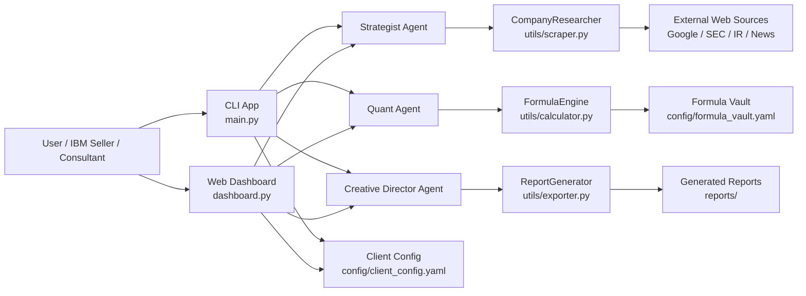
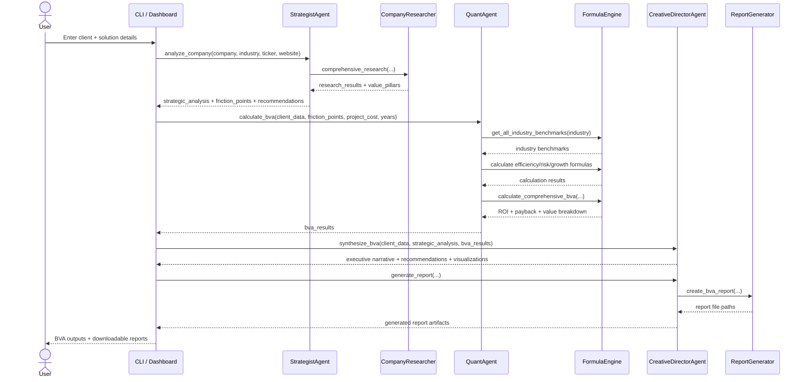
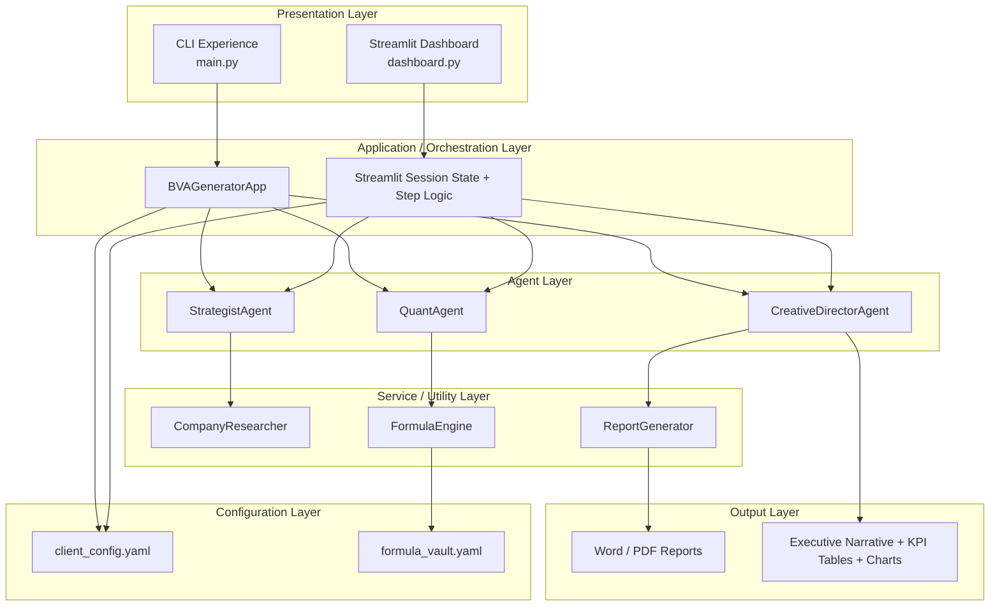

# BVA Agent Architecture Diagrams

This document contains Mermaid-based architecture diagrams for the BVA Generator Agent system.

## 1. System Context

## 2. Agent Orchestration Flow

## 3. Layered Internal Architecture

## 4. Research and Value Pipeline

```mermaid
flowchart LR
    Input["Client Inputs<br/>company, industry, product, ticker, website"]
    Research["Research Aggregation<br/>CompanyResearcher.comprehensive_research()"]
    Sources["Source Modules<br/>company info / SEC filings / investor relations / benchmarks / news"]
    Pillars["Strategic Output<br/>value pillars, opportunities, friction points"]
    Calc["Quantification<br/>efficiency + risk + growth calculations"]
    BVA["BVA Summary<br/>annual value, ROI, payback, breakdown"]
    Synthesis["Executive Synthesis<br/>priority mapping + narrative + recommendations"]
    Report["Report Export<br/>.docx / optional PDF"]

    Input --> Research
    Research --> Sources
    Sources --> Pillars
    Pillars --> Calc
    Calc --> BVA
    BVA --> Synthesis
    Synthesis --> Report
```

## Notes

- The primary entry points are [`main.py`](../main.py) and [`dashboard.py`](../dashboard.py).
- The core agents are [`StrategistAgent`](../agents/strategist.py), [`QuantAgent`](../agents/quant.py), and [`CreativeDirectorAgent`](../agents/creative.py).
- Supporting services are [`CompanyResearcher`](../utils/scraper.py), [`FormulaEngine`](../utils/calculator.py), and [`ReportGenerator`](../utils/exporter.py).
- The formulas and benchmarks are loaded from [`formula_vault.yaml`](../config/formula_vault.yaml).